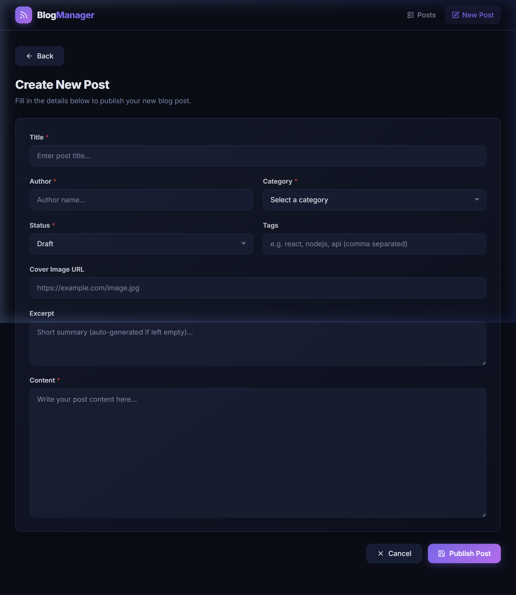
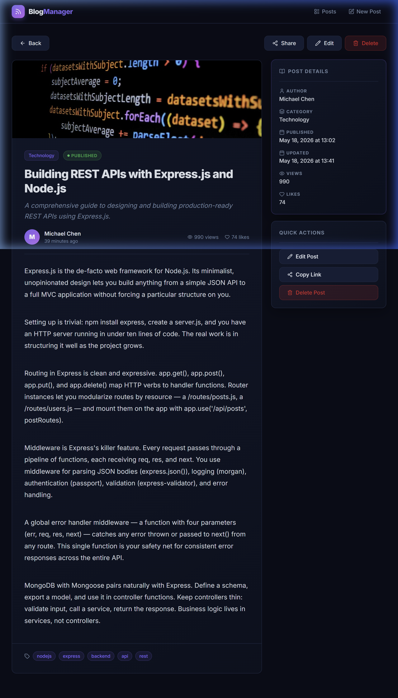
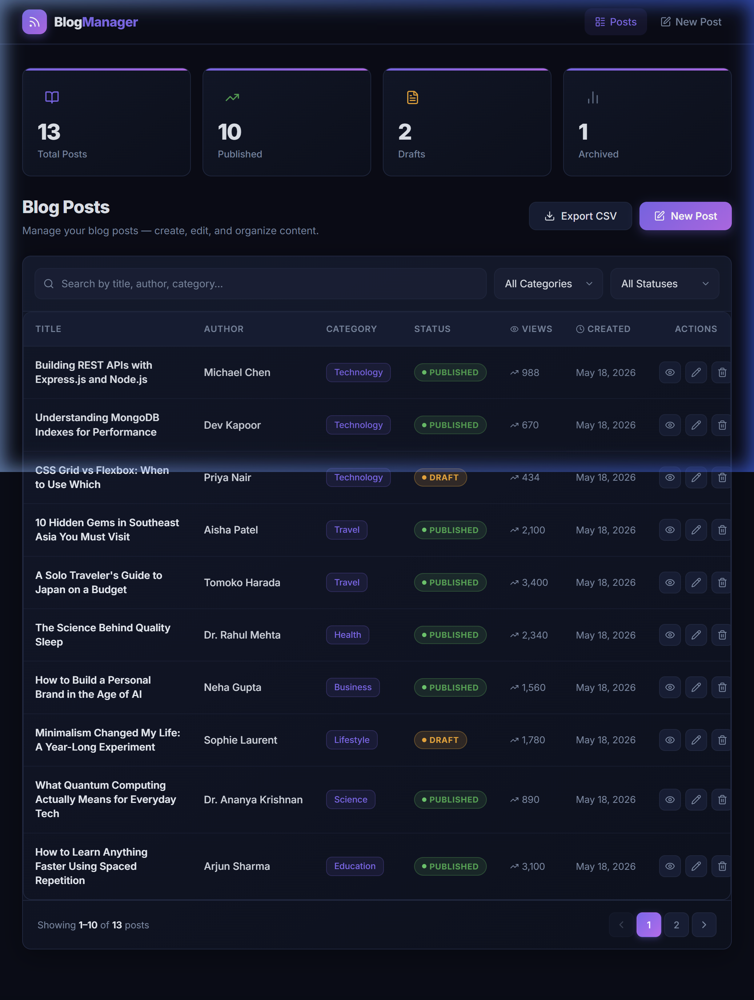

# 📝 Blog Post Management System

A full-stack Blog Post Management System built with React + Vite (frontend) and Node.js + Express + MongoDB (backend).

---

## 📸 Screenshots

### 🗂️ Screen 1 — Post List (Dashboard & Table)
> Stats cards showing total / published / draft / archived counts, a filterable + searchable table with pagination, and Export CSV + New Post actions.



---

### ✍️ Screen 2 — Create / Edit Post (Form)
> Validated form with Title, Author, Category, Status, Tags, Cover Image URL, Excerpt, and Content fields. Supports both Add and Edit modes.



---

### 👁️ Screen 3 — View Post (Detail Page)
> Full article view with cover image, author avatar, read time, views, likes, tags, and a sidebar with post metadata and quick actions.



## 🚀 Tech Stack

| Layer | Tech |
|-------|------|
| Frontend | React 19, Vite, React Router v6, React Hook Form, Zod, Axios, Lucide Icons |
| Styling | Tailwind CSS v4 (via `@tailwindcss/vite`), custom CSS variables (dark theme) |
| Backend | Node.js, Express.js |
| Database | MongoDB + Mongoose |
| Validation | express-validator (BE), Zod + React Hook Form (FE) |
| Notifications | react-hot-toast |

---

## 📁 Project Structure

```
blog-managment/
├── backend/
│   ├── src/
│   │   ├── config/db.js            # MongoDB connection
│   │   ├── controllers/postController.js  # CRUD + export + stats
│   │   ├── models/Post.js          # Mongoose schema
│   │   ├── routes/postRoutes.js    # Express routes
│   │   ├── middlewares/
│   │   │   ├── errorHandler.js     # Global error handling
│   │   │   └── validatePost.js     # Input validation
│   │   └── utils/csvExporter.js    # CSV generation
│   ├── .env
│   ├── .env.example
│   └── server.js
│
├── frontend/
│   ├── src/
│   │   ├── api/postApi.js          # Axios API layer
│   │   ├── components/
│   │   │   ├── layout/             # Navbar, PageWrapper
│   │   │   ├── posts/              # PostTable, PostForm, PostFilters, PostStatusBadge
│   │   │   └── common/             # ConfirmModal, Pagination
│   │   ├── pages/
│   │   │   ├── PostListPage.jsx    # Screen 1 – Table + stats
│   │   │   ├── PostFormPage.jsx    # Screen 2 – Add/Edit
│   │   │   └── PostViewPage.jsx    # Screen 3 – View details
│   │   ├── hooks/usePosts.js       # Data fetching hook
│   │   ├── utils/
│   │   │   ├── validators.js       # Zod schemas
│   │   │   └── helpers.js          # Date, download, cn helpers
│   │   ├── constants/index.js      # Categories, statuses, etc.
│   │   ├── App.jsx                 # Router
│   │   └── main.jsx
│   ├── .env
│   └── .env.example
│
└── README.md
```

---

## ⚙️ Environment Variables

### Backend (`backend/.env`)

| Variable | Description | Default |
|----------|-------------|---------|
| `PORT` | Server port | `5000` |
| `MONGO_URI` | MongoDB connection string | — |
| `FRONTEND_URL` | Allowed CORS origin | `*` |
| `NODE_ENV` | Environment | `development` |

### Frontend (`frontend/.env`)

| Variable | Description | Default |
|----------|-------------|---------|
| `VITE_API_URL` | Backend API base URL | `http://localhost:5000/api` |

---

## 🛠️ Setup & Running Locally

### Prerequisites
- Node.js v18+
- MongoDB Atlas account (or local MongoDB)

### 1. Clone and install

```bash
# Backend
cd backend
npm install

# Create your .env file
cp .env.example .env
# Edit .env and set MONGO_URI to your MongoDB connection string

# Frontend
cd ../frontend
npm install
cp .env.example .env
```

### 2. Start Backend

```bash
cd backend
npm run dev   # uses nodemon for hot reload
# or
npm start     # production
```

The API will be available at `http://localhost:5000`

### 3. Seed the Database (Optional)

```bash
cd backend
npm run seed   # inserts 13 sample posts across 8 categories
```

### 4. Start Frontend

```bash
cd frontend
npm run dev
```

Open `http://localhost:5173` in your browser.

---

## 🌐 API Endpoints

| Method | Endpoint | Description |
|--------|----------|-------------|
| `GET` | `/api/health` | Health check |
| `GET` | `/api/posts` | List posts (pagination + search + filter) |
| `GET` | `/api/posts/stats` | Dashboard statistics |
| `GET` | `/api/posts/export` | Export posts as CSV |
| `GET` | `/api/posts/:id` | Get single post |
| `POST` | `/api/posts` | Create post |
| `PUT` | `/api/posts/:id` | Update post |
| `DELETE` | `/api/posts/:id` | Delete post |

### Query Parameters (GET /api/posts)

| Param | Type | Description |
|-------|------|-------------|
| `page` | number | Page number (default: 1) |
| `limit` | number | Items per page (default: 10) |
| `search` | string | Search by title, author, category |
| `category` | string | Filter by category |
| `status` | string | Filter by status (draft/published/archived) |
| `sortBy` | string | Sort field (default: createdAt) |
| `sortOrder` | string | `asc` or `desc` (default: desc) |

---

## ✨ Features

- **CRUD** — Create, Read, Update, Delete blog posts
- **Pagination** — Server-side with navigation
- **Search & Filter** — By title, author, category, status
- **CSV Export** — Export filtered results
- **Dashboard Stats** — Total, published, draft, archived counts
- **Form Validation** — Client (Zod + RHF) + Server (express-validator)
- **Error Handling** — Global middleware + toast notifications
- **Dark Theme** — Premium glassmorphism dark UI
- **Responsive** — Mobile-first design
- **Auto Read Time** — Calculated on save (~200 wpm)
- **Auto Excerpt** — Generated from content if not provided
- **View Counter** — Increments on post view
